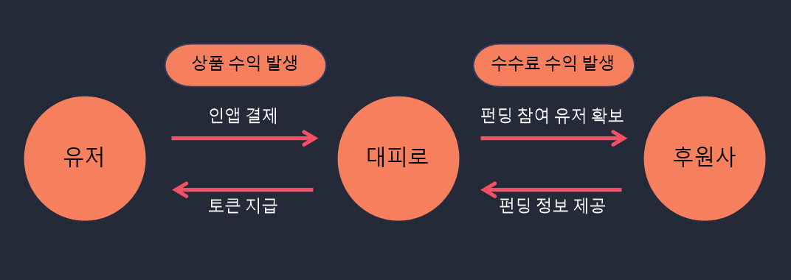

### *학회원 여러분께 제공하는 28기 세미밋업데이 산출물 readme 의 레퍼런스 문서입니다. 하단 내용은 모두 예시로 구성된 것으로 자유롭게 readme 파일을 구성해주시면 됩니다.*
 

27기 세미밋업 README 파일 링크

[GitHub - kusitms-com/27th_Semi_README: 27기 세미밋업용 산출물 리드미 저장 Repository입니다.](https://github.com/kusitms-com/27th_Semi_README/tree/main)

# 🌟 서비스명

  

## 서비스 소개를 적어주세요.
### 가장 안전한 길로, 대피로
‘대피로’는 다양한 위험에 노출되어 있는 한국 사회에서 정확한 정보를 제공 받고 신속하게 대응할 수 있도록 돕는 안전•재난 알림 서비스입니다.
 
 

> **‘대피로’는 모든 이용자들이 정확한 상황과 대응 방법을 전달 받을 수 있도록 도와, 위험 상황에 대한 혼란과 불안을 해소할 수 있길 기대합니다**

* 목적 및 필요성
  + (1) 기획 배경
    -최근 북한 공습 경보 사건, 이태원 참사, 칼부림 사건 등 다양한 위기 상황이 발생하면서 안전에 대한 니즈가 커지고 있습니다.   현재 위기 상황이 발생하면 정부로부터 재난 문자가 발송되고 국민들은 재난 문자를 통해 상황을 인지합니다.  재난 문자는 상황이 발생했을 때 즉시 발송되어 위기 상황을 신속히 인지할 수 있도록 합니다.  
    하지만 위기 상황에 대한 구체적인 정보와 대응 방법이 부재하고 지역에 따른 정보 불균형 문제 등으로 인해 재난 문자에 대한 불만이 커지고 있습니다.  위기 상황에 따른 정확한 대응 방법을 알지 못해 크고 작은 피해가 발생하고 있습니다.   안전에 대한 대응 방법을 어렴풋이 알고는 있지만 정보에 대한 불신과 혼란으로 인해 실제 행동으로 이어지지 않습니다.  따라서 모든 국민의 안전을 위해 구체적인 정보와 대응 방법을 제공하고 실제 행동까지 이끌어주는 ‘안전 길라잡이’가 간절히 필요합니다

## 🕊️ 팀명
### 팀명 : 
 

## R&R

| 분야 | 이름 | 포지션 |
| --- | --- | --- |
| 기획 | 김연지 | 📣 프로젝트 매니징, 서비스 기획, 시장 리서치 담당 |
| 기획 | 문성욱 | 💡 기획 리드, 서비스 기획, 와이어 프레임 담당 |
| 기획 | 송민호 | 🔑 서비스 기획, 데이터 분석 담당 |
| 디자인 | 한수현 | 🎨 프로토타입, 서비스 디자인 담당 |
| 개발 | 노영진 | 🔌 개발 리드, 서버 개발 담당 |
| 개발 | 이재현 | 🖥 서버 개발 담당 |
| 개발 | 송승희 | 📱 Android 개발 담당 |
| 개발 | 오종석 | 📐 Android 개발 담당 |
 

## 🔎 목적 및 필요성

### 목적

이 서비스를 통해 어떤 문제를 해결하고 싶은지, 서비스를 기획하는 목적을 작성해주세요. 
 
### 필요성

데스크리서치, 유저리서치 등을 바탕으로 파악한 이 서비스의 필요성을 작성해주시면 됩니다. 
   
## 📊 리서치 및 시장조사
### 1️⃣ 경쟁사 분석
 

### 2️⃣ 목표 시장

| TAM | SAM | SOM |
| --- | --- | --- |
|  |  |  |
| 000만 명 | 000만 명 | 00만 명 |

> *앱 다운로드 건 수 00만 건(수익시장의 00%) 확보를 시작으로, 점차 시장을 넓혀갈 예정입니다.*
> 
 

### 3️⃣ 유저리서치 분석
 

## 👀 서비스 타겟층 정의

00의 목표 타겟은 … 입니다.

| 분류 | 1차 타겟 유저 | 2차 타겟 유저 |
| --- | --- | --- |
| 타겟 설정 |  |  |
| 관련 기능 |  |  |
 

## 💡 서비스 소개

### **개요**
 

### 핵심 기능

***팀 내의 논의 결과에 따라 메뉴구조도, 플로우차트, 서비스블루프린트 등의 기획문서를 작성하여 첨부해주세요.***
   
## 📊 서비스 비즈니스 모델

|  | 관련 파트너 1 | 관련 파트너 2 | 내용 |
| --- | --- | --- | --- |
| STEP 1 | 유저 | 대피로 | 토큰 발급을 위한 인앱 결제 |
| STEP 2 | 대피로 | 유저 | 1.지급된 토큰을 통한 펀딩 참여 및 추가 콘텐츠 이동 기회 부여   2. 충성 고객을 확보해 User Retention을 유지 및 상승시키는데 도움 |
| STEP 3 | 대피로 | 후원 | 펀딩 참여자 확보에 도움 |
| STEP 4 | 후원사 | 대피 | 수수료 지급 및 펀딩 관련 도움 제공  |

  

## **🎨 디자인 무드보드**

  

## **🔍 System Architecture**

// 시스템 아키텍쳐 이미지를 넣어주세요
  

## **💻 Technology**

// 각 파트별 스택을 적어주세요

- Web / Android
  -
  -

  

  
- Server
  -
  -
    
  
- Co-working Tool
  -
  -

   

  

### **🐾 기술 스택 선정 이유**

// 각 파트별 기술 스택 선정 이유를 적어주세요

### **📘 Web/Android 스택 선정 이유**
  
### **📗 Server 스택 선정 이유**

  

## 🔖 Naming Rules

// 팀 별 네이밍룰을 적어주세요
   

## **🗂️ Commit Convention**

// 팀 별 커밋 컨벤션을 적어주세요
  

### **📌 Type**

| commit 명 | commit 뜻 |
| --- | --- |
|     |     |
|  |  |
|  |  |
|  |  |

 

## **🐬 Git Flow**

// 팀 별 깃 플로우를 적어주세요

 
